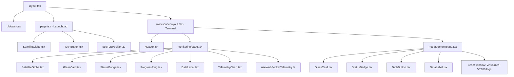

# ArbaLabs Aerospace Satellite Platform — Architecture & Component Documentation

Welcome to the official developer documentation and component structure overview for the **ArbaLabs Satellite Platform**. This document provides an in-depth breakdown of the project directory, core visual tokens, component relationships, data flow, custom hooks, and page layout systems.

---

## 📁 Project Directory Structure

Below is the complete architectural layout of the source files in `d:\ARBALABS`:

```yaml
d:\ARBALABS
├── docs/
│   ├── architecture.md           # This document (Architecture & Components)
│   ├── design.md                 # Design specifications & aesthetic guidelines
│   └── implementation_plan.md    # Initial feature outlines & milestones
├── public/
│   ├── arbalabs-logo.png         # Authentic brand asset logo (invertable)
│   ├── earth-map.jpg             # High-res 2D global equirectangular backdrop
│   └── favicon.ico               # Tab icon
├── src/
│   ├── app/
│   │   ├── api/
│   │   │   └── satellite/
│   │   │       └── tle/
│   │   │           └── route.ts  # Cached server proxy to CelesTrak TLE API
│   │   ├── workspace/
│   │   │   ├── management/
│   │   │   │   └── page.tsx      # Terminal: SHA-256, payload uploader, operator VT100
│   │   │   ├── monitoring/
│   │   │   │   └── page.tsx      # Terminal: Live charts, 2D orbit tracking, event feeds
│   │   │   └── layout.tsx        # Terminal Workspace tab switcher & header bindings
│   │   ├── globals.css           # Tailwind v4 configuration, font overrides, visual tokens
│   │   ├── layout.tsx            # Global HTML layout, Google Fonts (IBM Plex, Public, JetBrains)
│   │   └── page.tsx              # Launchpad: Grand countdown system & mission vitals
│   ├── components/
│   │   ├── globe/
│   │   │   └── SatelliteGlobe.tsx # 2D Equirectangular map visualizer (Sentinel-2A/2B overlays)
│   │   ├── layout/
│   │   │   └── Header.tsx        # Responsive context-aware header & UTC clock
│   │   ├── telemetry/
│   │   │   └── TelemetryChart.tsx # SVG step-line chart with responsive ResizeObservers
│   │   └── ui/
│   │       ├── DataLabel.tsx     # Standard data readout row with trend vectors
│   │       ├── GlassCard.tsx     # Solid premium neutral zinc card container
│   │       ├── GridBackground.tsx # Faint hardware-inspired grid background alignment aid
│   │       ├── ProgressRing.tsx  # Circular SVG gauge for memory/compute metrics
│   │       ├── StatusBadge.tsx   # Color-coded LED state flags
│   │       └── TechButton.tsx    # Styled buttons with active scale micro-interactions
│   └── hooks/
│       ├── useTLEPosition.ts     # SGP4 orbital propagator engine using satellite.js
│       └── useWebSocketTelemetry.ts # 1Hz frequency telemetry simulated WebSocket vitals
├── package.json                  # Light modern build system configurations
└── tsconfig.json                 # Unified TypeScript configurations
```

---

## 🎨 Visual Identity & Core Tokens

The visual system is engineered around a premium hardware-console aesthetic rather than soft consumer-web layout guidelines:

1. **Colors**:
   - **Backgrounds**: Pure black `#000000` to maximize visual depth and battery optimization.
   - **Panels/Cards**: Flat, solid Zinc (`#18181B` or `#111111`) separated by razor-thin borders (`#27272A`).
   - **Muted Elements**: Secondary labels, cryptohashes, and minor info lines use `#A1A1AA` to optimize reading hierarchies.
   - **LED Status Highlights**: Non-neon accents are mapped to clear standard status colors (Emerald `#10b981` NOMINAL, Sky `#0ea5e9` INFO, Amber `#f59e0b` WARN, Red `#ef4444` ALERT).
2. **Typography**:
   - **Brand Headings**: `IBM Plex Sans` (Industrial, solid character width).
   - **Tabular Vitals**: `Public Sans` with forced layout overrides (`font-variant-numeric: tabular-nums`) to completely eliminate text-shifting during real-time modifications.
   - **Syslogs & Code**: `JetBrains Mono` for exact alignment.

---

## 🏗️ Component Structure & Dependency Tree

The platform is modular, passing live telemetry and positional states cleanly down the hierarchy:



---

## 🔌 State Management & Custom Hooks

The platform runs two core data engines to feed real-time visual telemetry:

### 1. `useTLEPosition.ts` (SGP4 Propagation Engine)
- **Purpose**: Calculates precise real-world locations for Sentinel-2A and 2B.
- **Data Flow**:
  1. Calls `/api/satellite/tle` during mount.
  2. The Next.js API endpoint proxies requests server-side to the public CelesTrak database (NORAD catalog numbers `40697` and `42063`), fetching raw Two-Line Element logs.
  3. Propagates the data at 5s intervals through `satellite.js` SGP4 algorithms to obtain geodesic longitude, latitude, altitude (km), and velocity (km/h).
  4. Delivers the geodetic coordinates to `SatelliteGlobe.tsx` and text readouts.
  5. *Fallback*: Automatically deploys high-accuracy simulated coordinates if the third-party public API is temporarily unresponsive.

### 2. `useWebSocketTelemetry.ts` (1Hz Telemetry Simulator)
- **Purpose**: Generates high-fidelity hardware data simulation.
- **Data Flow**:
  - Sets up a standard client-side clock loop firing at 1Hz (1-second intervals).
  - Simulates dynamic parameters: AI compute memory, inference processing speed (FPS), internal radiation levels (mSv/h), power bus margins, and temperatures.
  - Automatically writes anomalies or milestones directly into the log buffer.

---

## 🧬 Component Deep-Dive

### 1. `SatelliteGlobe.tsx` (2D Projection Map)
- **Visual Method**: Operates as a 2D equirectangular coordinate mapper overlaying the high-resolution `/earth-map.jpg?v=2` image.
- **Calculations**: Translates latitude (-90° to 90°) and longitude (-180° to 180°) into exact `left` and `top` percentages:
  $$\text{Percent } X = \frac{\text{lon} + 180}{360} \times 100$$
  $$\text{Percent } Y = \frac{90 - \text{lat}}{180} \times 100$$
- **Caching**: Appends a `?v=2` cache-buster to the background image source to bypass aggressive local browser caches and instantly refresh the curved Earth asset.

### 2. `TelemetryChart.tsx` (Precision Step Line Chart)
- **Graphics Engine**: Fully constructed from native SVG vector elements for lightweight rendering and sub-pixel precision.
- **Plotting Path**: Renders telemetry as a staircase step line (horizontal then vertical movements) rather than standard curves, evoking authentic industrial monitoring equipment.
- **Resize Tracking**: Employs an internal `ResizeObserver` on the parent card to dynamically redraw and adjust the SVG viewport widths without forcing full page redraws.
- **Interaction**: Captures vector coordinates on pointer-movement, identifying the closest telemetry indices to draw target line trackers and hover overlays.

### 3. `ProgressRing.tsx` (Compute Metric Circle)
- **Calculations**: Renders circular hardware-meter style dials by calculating SVG `strokeDasharray` and adjusting the active offset based on percentages:
  $$\text{Circumference} = 2 \pi r$$
  $$\text{Offset} = \text{Circumference} - \left(\frac{\text{Percentage}}{100} \times \text{Circumference}\right)$$
- **LED states**: Visual styles automatically map to clear, distinct colored outlines without pulsing triggers.

---

## 📡 Core Pages & Routing Schema

### 1. Launchpad (`/src/app/page.tsx`)
- **Focus**: Key mission countdown.
- **Target Launch**: Locked onto **June 10, 2026**.
- **Visuals**: Full-screen 2D background orbit map with mission spec cards overlaying live-recomputed velocity and altitude updates. Features a fast link in the header: **"Open Terminal"**.

### 2. Terminal - Monitoring (`/src/app/workspace/monitoring/page.tsx`)
- **Focus**: Data dense live operations.
- **Layout**: Compelled into a highly readable, compact multi-row layout:
  - **Top Row**: 3/5 width 2D Orbital Map (height capped at 280px to eliminate wasted spaces) alongside 2/5 width AI Edge Core vitals (CPU/Memory gauges).
  - **Bottom Row**: 3/5 width split Systems Telemetry Charts alongside 2/5 width scrollable Event Feed with type filters.

### 3. Terminal - Management (`/src/app/workspace/management/page.tsx`)
- **Focus**: Actions, uploads, and raw configurations.
- **Features**:
  - **SHA-256 Provenance Audit Ledger**: Live expected-vs-actual hash validator with manual anomaly trigger modes.
  - **Payload Uploader**: High-fidelity drag-and-drop file queues with active speed/ETA progression streams.
  - **Virtualized VT100 Log Console**: Uses `react-window` fixed lists to render virtualized, high-density system logs without layout lag. Caches hover actions to pause streaming on-demand.
